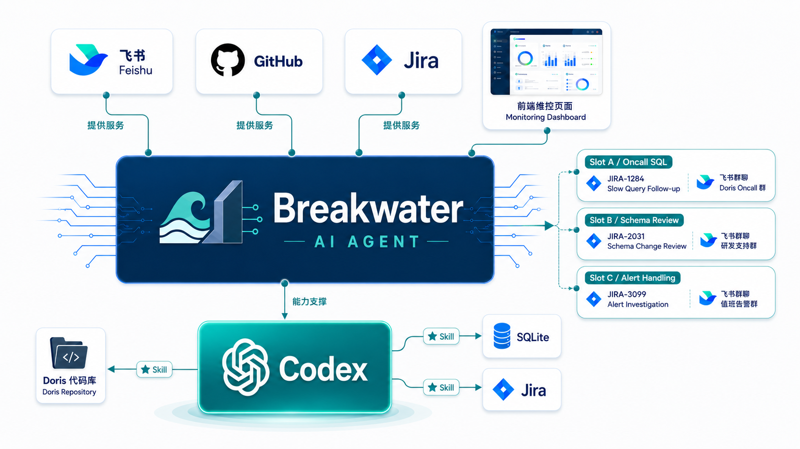

# Breakwater

Breakwater 是一个本地 on-call agent 服务。它的含义来自“防波堤”：利用大模型能力和历史数据，把绝大多数线上问题在最早期拦住，让研发只需要处理真正需要判断力的部分。


## 价值

Breakwater 可以作为一个数字员工，完整参与问题的处理：

- Github Issue、Jira Issue 的创建跟踪、自动分析；
- 飞书内自动将群聊与 issue 聚合，延续分析上下文，回答任意问题；
- 结合本地代码库深入代码分析问题原因；
- 主动调用 Jira 历史寻找疑似问题与解决方案；
- 主动进行 issue 结案总结，跟进情况复盘；
- 按要求完成端到端代码开发并向上游提交

在 oncall 流程中，成为“人类的上位替代”。

## 架构



## 配置

服务启动默认读取当前项目的 `config.yaml`。CLI 参数会覆盖配置文件。可以从 [config.example.yaml](config.example.yaml) 复制一份本地配置；不要提交真实 `config.yaml`。Jira token 可以通过配置文件提供，用于让 Breakwater 和它启动的 Codex/Jira skill 使用指定账号：

```yaml
JIRA_TOKEN: your-token
```

也可以通过环境变量提供：

```bash
export JIRA_TOKEN=...
uv run breakwater serve
```

也可以显式传入：

```bash
uv run breakwater serve --config config.yaml --jira-token "$JIRA_TOKEN"
```

关键配置项：

```yaml
JIRA_TOKEN: null
JIRA_URL: https://jira.example.com

codex:
  url: ws://127.0.0.1:17345
  model: null
  effort: null
  workspace: ${PROJECT_ROOT}
  sandbox: workspace-write
  start_server: true

proxy:
  enabled: true
  http: http://127.0.0.1:7890
  https: http://127.0.0.1:7890
  all: socks5h://127.0.0.1:7890
  no_proxy: 127.0.0.1,localhost

queue:
  concurrency: 5

jira:
  enabled: true
  record_new_issues: false
  auto_analyze_new_issues: false
  auto_analyze_projects: [OPS]
  status_summary_enabled: false
  status_summary_projects: [OPS]
  status_summary_target_statuses: [Done, Backlog]
  bot_mention_keys: [breakwater-bot]
  skill_dir: skills/jira-issue
  token: null
  projects: [OPS, APP]

github:
  enabled: false
  repositories: []
  auto_analyze: false
  poll_interval_seconds: 300

develop:
  enabled: true
  skill_dir: skills/breakwater-develop

prompt_variables:
  DEVELOP_DEFAULT_REPOSITORY: ${CODEX_WORKSPACE}

web:
  enabled: true
  host: 127.0.0.1
  port: 8765

admin_web:
  enabled: false
  host: 127.0.0.1
  port: 8766
  password_hash: null
  session_secret: null
```

`JIRA_TOKEN: null` 和 `jira.token: null` 表示缺省使用环境变量 `JIRA_TOKEN`。推荐新配置使用顶层 `JIRA_TOKEN`，`jira.token` 保留兼容。Breakwater 会在启动 Codex app-server 时注入该环境变量，并在每个 Codex thread 的 shell 环境里设置 `JIRA_TOKEN`，所以外部已运行的 app-server 也能让 Jira skill 命令拿到对应凭据。

`jira.record_new_issues: false` 表示只监控分析触发评论，不额外记录新建 issue。改为 `true` 后状态页会显示 New Jira Issues。

`jira.bot_mention_keys` 是 Jira 真实 @ 触发的白名单，填 Jira REST 评论里真实 mention 的 user key、accountId 或结构化 mention id。Breakwater 只识别 `[~user]`、`[~accountid:...]` 或 Jira 返回的结构化 mention 节点；普通正文里的 `@Breakwater` 字样不会触发。

`jira.auto_analyze_new_issues: true` 表示新建 issue 也会进入 Codex 分析闭环。`jira.auto_analyze_projects` 控制哪些项目的新 issue 会自动分析；为空时默认使用 `jira.projects` 全部项目，且不能越过 `jira.projects` 这个硬边界。如果 `record_new_issues` 仍为 `false`，新增 issue 记录也只覆盖这些自动分析项目；如果 `record_new_issues` 为 `true`，则仍记录所有 `jira.projects` 的新 issue。自动分析复用 Jira case、Codex 队列、Jira marker 校验和有限重试机制，不单独引入另一套状态机。

新建 issue 自动分析还有一个硬编码的跳过开关：如果 issue 的 summary、description、environment、labels 或 components 中包含 `/no-analyze`，Breakwater 仍可记录该 issue，但不会为它创建 `jira_issue_auto_analyze` slot。

`jira.status_summary_enabled: true` 表示当指定项目的 issue 状态从已知旧状态变化到 `status_summary_target_statuses` 时，自动创建 `jira_status_summary` slot，让 Codex 通过 Jira skill 阅读 issue 并评论简要总结。首次观察到已经处于目标状态的历史 issue 只建立状态基线，不回补触发；后续只有真实状态变化才触发。状态变化 envelope 只保存在本地结构化日志中，不作为 prompt 证据传给 Codex。`/no-analyze` 同样会阻止状态总结 slot。

自动初始分析和状态总结还会写入结构化后台记录。`jira_issue_auto_analyze` 必须额外上报 `missing_required_material`，表示 Jira 是否缺少分析所必需材料；记录里会标记 reporter。`jira_status_summary` 必须额外上报 `has_clear_resolution`，表示 Jira 是否已有明确结论和解决办法；记录里会标记 assignee。该结构化上报通过 prompt 中的 `breakwater automation-report <slot_id> --json-file ...` 完成，Breakwater 只有在 Jira marker 和结构化上报都存在时才把对应自动化 slot 标记成功。

管理后台与 8765 状态页分离，默认关闭。先生成密码 hash：

```bash
uv run breakwater admin-hash-password --password 'your-password'
```

然后把输出填入 `admin_web.password_hash` 并设置 `admin_web.enabled: true`。也可以直接运行独立后台：

```bash
BREAKWATER_ADMIN_PASSWORD_HASH='<hash>' uv run breakwater admin-web --port 8766
```

`github.repositories` 使用 `owner/name` 形式配置要监控的仓库，例如 `octo-org/example-repo`。`github.auto_analyze: true` 会为新增 issue 创建 `github_issue_analyze` slot；Codex 必须通过 `breakwater github-comment` 评论原 issue，Breakwater 读回包含 `Breakwater-GitHub-Analysis-Slot: <slot_id>` 的评论后才完成该 slot。首次启动只初始化 cursor，不回溯历史 issue。

## 运行

启动完整后台服务：

```bash
uv run breakwater start --config config.yaml
```

停止后台服务：

```bash
uv run breakwater stop
```

`start` 会写入 `.breakwater/breakwater.pid`，并且每次启动都会创建新的日志文件，默认形如 `.breakwater/logs/breakwater-YYYYmmdd-HHMMSS-ffffff.log`。`serve` 仍可用于前台调试。

状态页默认地址：

```text
http://127.0.0.1:8765
```

手动执行一次 Jira 轮询：

```bash
uv run breakwater jira-poll
```

手动执行一次 GitHub issue 轮询：

```bash
uv run breakwater github-poll --repo octo-org/example-repo --auto-analyze
```

如果需要手动记录新建 issue：

```bash
uv run breakwater jira-poll --record-new-issues
```

如果需要手动验证新增 issue 自动分析路径：

```bash
uv run breakwater jira-poll --no-bootstrap --auto-analyze-new-issues --auto-analyze-project OPS
```

不加 `--no-bootstrap` 时，首次运行只初始化 cursor，不会回溯已有 issue。

查看最近 slot：

```bash
uv run breakwater status --json
```

查看最近 analysis case：

```bash
uv run breakwater cases
uv run breakwater cases --json
uv run breakwater case OPS-1234
uv run breakwater case slot_abc123def456 --json
```

## Prompt 和 Skill

所有运行时 prompt 集中在 [prompts/breakwater.md](prompts/breakwater.md)，服务会在下一次 Codex 任务前自动重载文件修改。

项目内置 Jira skill 位于 [skills/jira-issue](skills/jira-issue)。prompt 中会明确告诉 Codex skill 的 `SKILL.md` 路径；如果路径不存在，prompt 会要求 Codex 报告缺失路径，而不是猜测其他 Jira 写入路径。

项目内置 develop skill 位于 [skills/breakwater-develop](skills/breakwater-develop)。prompt 会要求 Codex 只在识别到明确 coding 意图且本地仓库、权限、任务信息满足前置条件时调用它。将 `develop.skill_dir` 指向另一个 skill 目录即可替换为外部派发/验收后端。

Prompt 支持 `${XXX}` 或 `$XXX` 变量。渲染前会统一合并运行时变量和 `config.yaml` 中的 `prompt_variables` / `variables`，并补充 `PROJECT_ROOT`、`CODEX_WORKSPACE`、`DB_PATH`、`JIRA_SKILL_DIR`、`DEVELOP_SKILL_DIR` 等内置变量。

`codex.workspace` 是提交给 Codex app-server 的真实 `cwd`。`PROJECT_ROOT` 始终表示 Breakwater 项目根目录，`CODEX_WORKSPACE` 表示 Codex 实际运行目录。

`proxy.enabled: true` 默认等价于本机常用的 `proxy_on`：设置 `http_proxy` / `https_proxy` 到 `http://127.0.0.1:7890`，设置 `all_proxy` 到 `socks5h://127.0.0.1:7890`，并传递给 Breakwater、Codex app-server、Jira skill 等子进程。

## 测试

```bash
uv run python -m unittest discover -s tests -v
```
